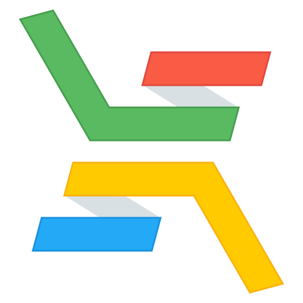

# Our logos

Find here the logos of our organization as well as those of the solutions we
provide. Please include the appropriate logos on your poster or presentation if
you make use of our products. Just please do not try to make it look as if we
are in any kind of way endorsing you or your product. Thank you!

## Colors

The HEX codes of the colors in our logo are:

* Red: `#f95b45`
* Red (secondary): `#e2483e`
* Green: `#5aba62`
* Green (secondary): `#469f4e`
* Yellow: `#ffcb00`
* Yellow (secondary): `#fcb20f`
* Blue: `#23a9f6`
* Blue (secondary): `#1b92e1`

## ELIXIR Cloud & AAI organization

### Raster graphics

**PNG 32px**  

**PNG 64px**  

**PNG 128px**  

**PNG 256px**  

**PNG 512px**  

### Vector graphics

Download [SVG](org/logo.svg)

## ELIXIR Cloud SDK

### Raster graphics

**PNG 32px**  

**PNG 64px**  

**PNG 128px**  

**PNG 256px**  

**PNG 512px**  

### Vector graphics

Download SVG in [light](cloud/logo.svg) or [dark](cloud/logo_dark.svg)

## ELIXIR Cloud SDK

### Raster graphics

**PNG 32px**  

**PNG 64px**  

**PNG 128px**  

**PNG 256px**  

**PNG 512px**  

### Vector graphics

Download SVG in [light](cloud_sdk/logo.svg) or [dark](cloud_sdk/logo_dark.svg)
